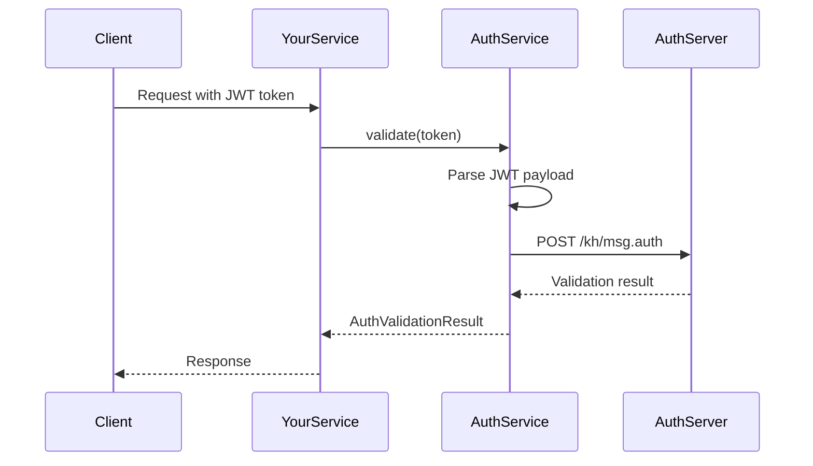

# Auth Module - 通用认证模块

## 概述

AuthModule 是一个通用的认证服务模块，已从 `dragon-websocket` 项目提取到 `@dragon/common` 库中，供所有后端项目复用。

## 功能特性

- ✅ 基于 HTTP 的 Token 验证
- ✅ 支持直接 HTTP URL 或 Nacos 服务名配置
- ✅ 自动解析 JWT Payload
- ✅ 与现有 gateway 认证架构兼容
- ✅ 全局模块，无需在每个模块中导入

## 使用方法

### 1. 在项目中导入 AuthModule

```typescript
// app.module.ts 或其他根模块
import { AuthModule } from '@dragon/common';

@Module({
  imports: [
    ConfigModule,
    AuthModule,  // 作为全局模块导入
    // ... 其他模块
  ],
})
export class AppModule {}
```

### 2. 配置 Auth Service

在你的 Nacos 配置或本地配置文件中添加：

```json
{
  "server": {
    "authService": "dragon-auth"  // Nacos 服务名
    // 或
    "authService": "http://localhost:3001"  // 直接 HTTP URL
  }
}
```

### 3. 在服务中使用 AuthService

```typescript
import { Injectable } from '@nestjs/common';
import { AuthService } from '@dragon/common';

@Injectable()
export class YourService {
  constructor(private readonly authService: AuthService) {}

  async validateUserToken(token: string) {
    const result = await this.authService.validate(token);
    
    if (result.code === 0) {
      // Token 有效，使用 result.data
      console.log('User data:', result.data);
      return result.data;
    } else {
      // Token 无效
      throw new UnauthorizedException(result.message);
    }
  }
}
```

### 4. 在 Guard 中使用

```typescript
import { Injectable, CanActivate, ExecutionContext } from '@nestjs/common';
import { AuthService } from '@dragon/common';

@Injectable()
export class JwtAuthGuard implements CanActivate {
  constructor(private readonly authService: AuthService) {}

  async canActivate(context: ExecutionContext): Promise<boolean> {
    const request = context.switchToHttp().getRequest();
    const token = this.extractToken(request);
    
    if (!token) {
      return false;
    }

    const result = await this.authService.validate(token);
    
    if (result.code === 0) {
      request.user = result.data;
      return true;
    }
    
    return false;
  }

  private extractToken(request: any): string | null {
    const authHeader = request.headers.authorization;
    if (!authHeader) return null;
    
    const [type, token] = authHeader.split(' ');
    return type === 'Bearer' ? token : null;
  }
}
```

## API 文档

### AuthService.validate(accessToken: string)

验证 JWT token 的有效性。

**参数：**
- `accessToken` (string): JWT token，格式为 `header.payload.signature`

**返回值：** `Promise<AuthValidationResult>`

```typescript
interface AuthValidationResult {
  code: number;      // 0: 成功，其他: 错误码
  data?: any;        // 验证成功时返回用户数据
  message?: string;  // 错误消息
}
```

**JWT Payload 格式：**

```json
{
  "uid": "用户ID",
  "token": "实际的认证token"
}
```

**Auth Service 请求格式：**

```json
{
  "messageType": "user.check",
  "messageBody": {
    "uid": "用户ID",
    "token": "实际的认证token"
  }
}
```

## 工作流程



## 配置选项

### 使用 Nacos 服务名

```json
{
  "server": {
    "authService": "dragon-auth"
  }
}
```

AuthService 会自动通过 `NacosManager` 解析服务地址。

### 使用直接 URL

```json
{
  "server": {
    "authService": "http://auth-service:3001"
  }
}
```

适用于本地开发或不使用 Nacos 的环境。

## 已集成项目

- ✅ `dragon-websocket` - WebSocket 实时通信服务

## 迁移指南

如果你的项目中有自己的 AuthModule，可以按以下步骤迁移：

1. **删除本地 auth 模块**
   ```bash
   rm -rf src/auth/
   ```

2. **更新导入语句**
   ```typescript
   // 旧的导入
   import { AuthModule } from './auth/auth.module';
   import { AuthService } from './auth/auth.service';
   
   // 新的导入
   import { AuthModule, AuthService } from '@dragon/common';
   ```

3. **确保配置正确**
   检查 `server.authService` 配置项是否存在。

4. **测试验证**
   ```bash
   npm run build
   npm run test
   ```

## 错误处理

### 常见错误码

- `107`: Token 格式无效或 payload 缺少必要字段
- `-1`: Auth service 请求失败（网络错误、超时等）
- 其他: 由 auth service 返回的业务错误码

### 调试日志

AuthService 使用 NestJS Logger，可以通过以下方式查看详细日志：

```typescript
// 在你的 main.ts 中设置日志级别
app.useLogger(['error', 'warn', 'log', 'debug']);
```

## 注意事项

1. **全局模块**: AuthModule 使用 `@Global()` 装饰器，导入一次后全局可用
2. **超时设置**: HTTP 请求默认超时 5 秒
3. **依赖要求**: 需要项目中已配置 `@dragon/common` 和 `@nestjs/axios`

## 相关链接

- [NestJS HTTP Module 文档](https://docs.nestjs.com/techniques/http-module)
- [JWT 规范](https://jwt.io/)
- [@dragon/common 文档](../README.md)
